# 棋譜と LDA

floodgate にあるコンピュータ将棋同士の棋譜を、潜在的ディリクレ配分法 (LDA; Latent Dirichlet Allocation) にかけて眺めてみた。

LDA は、文章を分類する確率的なアルゴリズムの一種。勉強のために実装してみたので、適用する題材として floodgate の棋譜を使ってみた。

戦型別に分類されたらおもしろいと思ったのだけれど、結果を観ると、できてるような、できてないような……

## 設定

| パラメータ名 | 値 |
|:--:|--:|
| 棋譜数 | 87,643 |
| 語彙数 | 1,134 |
| トピック数 | 15 |
| α | 1 |
| β | 0.5 |
| サンプルサイズ | 1,000 |

戦型をおおざっぱに分類すると、これぐらいかと考えて、トピック数を 15 にした。

1. 矢倉
1. 横歩取り
1. 相掛かり
1. 角換わり
1. 一手損角換わり
1. 向飛車
1. 三間飛車
1. 四間飛車
1. 中飛車
1. 先手向飛車
1. 先手三間飛車
1. 先手四間飛車
1. 先手中飛車
1. 相振飛車
1. その他

もちろん、このとおりに分類されるとは考えてないけど、トピック数を決める指標として参考にした。

## 結果

最終的なパープレキシティは 344.687 程度だった。

### 各トピックの出現単語 Top 10

※玉も王と表記しています。

| トピック番号 | 1st | 2nd | 3rd | 4th | 5th | 6th | 7th | 8th | 9th | 10th |
|--:|:--:|:--:|:--:|:--:|:--:|:--:|:--:|:--:|:--:|:--:|
|  1 | ６二王 | ８二王 | ７二王 | ７二金 | ７二銀 | ６二金 | ３三角 | ４二飛 | ７八王 | ７一金 |
|  2 | ６四角 | ７七銀 | ７九王 | ３三銀 | ６九王 | ６七金 | ７九角 | ３一王 | ４二銀 | ４三金 |
|  3 | ９六歩 | ９五歩 | ９四歩 | ８五桂 | ９六香 | ９五香 | ９七歩 | ８四歩 | ９七香 | ８八王 |
|  4 | ５五歩 | ５四歩 | ５六歩 | ５五銀 | ５三銀 | ５七銀 | ５二飛 | ５八飛 | ５三歩 | ５三金 |
|  5 | ７五歩 | ７四歩 | ７六歩 | ７三銀 | ７五銀 | ７六銀 | ７三桂 | ７四銀 | ７三と | ６四銀 |
|  6 | １四歩 | １五歩 | １六歩 | ２五桂 | １四香 | １五香 | ２六歩 | １三歩 | ２二王 | １三香 |
|  7 | ６五歩 | ６四歩 | ６六歩 | ６三銀 | ６六銀 | ６七金 | ６五銀 | ５四銀 | ６二飛 | ６三金 |
|  8 | ７八金 | ６八金 | ８八王 | ７八王 | ６八王 | ７七銀 | ８八銀 | ７八銀 | ７九金 | ８八金 |
|  9 | ３五歩 | ３六歩 | ３四歩 | ３五銀 | ３四銀 | ３七銀 | ４六銀 | ３三と | ３七桂 | ３七と |
| 10 | ３二金 | ４二金 | ４二王 | ３三銀 | ３二王 | ５二金 | ６二銀 | ２二王 | ２二銀 | ３一王 |
| 11 | ４五歩 | ４六歩 | ４四歩 | ４七銀 | ４四銀 | ４五銀 | ５六銀 | ４三金 | ４三銀 | ４五桂 |
| 12 | ８六歩 | ８五歩 | ８六飛 | ８四歩 | ８七歩 | ８四飛 | ８二飛 | ８五飛 | ７八金 | ３二金 |
| 13 | ５五馬 | ４五角 | ５六角 | ５六馬 | ４七馬 | ８八馬 | ６五角 | ４六馬 | ４五馬 | ５四馬 |
| 14 | ２四歩 | ２五歩 | ２四飛 | ２三歩 | ２六歩 | ２八飛 | ２六飛 | ２五飛 | ７八金 | ３二金 |
| 15 | ４八王 | ２八王 | ３八銀 | ３八金 | ３八王 | ４八金 | ７七角 | ６七銀 | ３九王 | ６八飛 |

### 各トピックの単語クラウド

各トピックから単語をランダムサンプリングした結果を Tagxedo (http://www.tagxedo.com/) で可視化した。

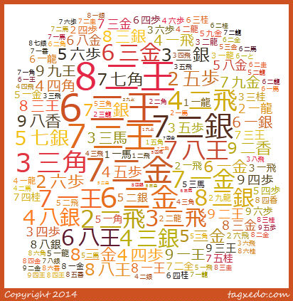
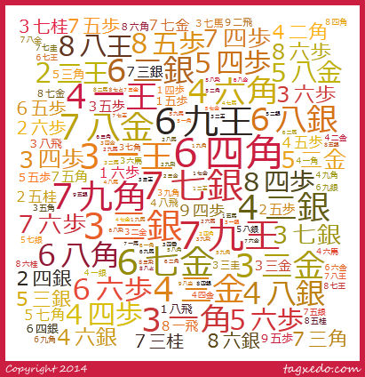
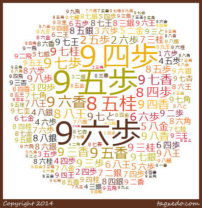
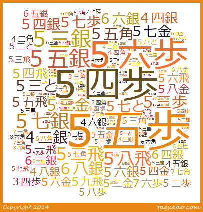
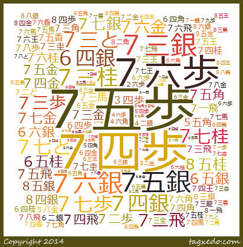
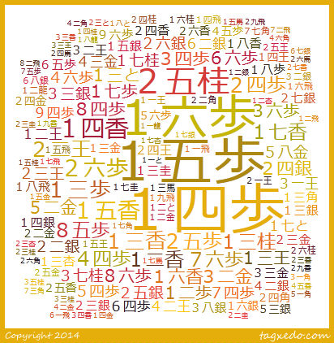
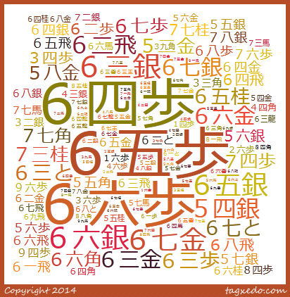
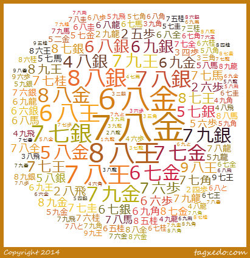
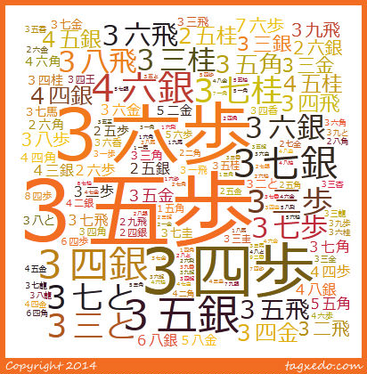
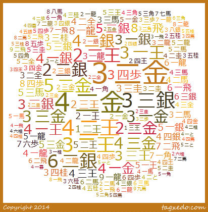
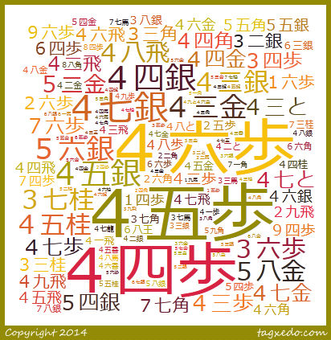
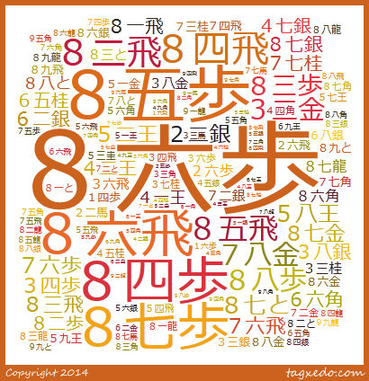
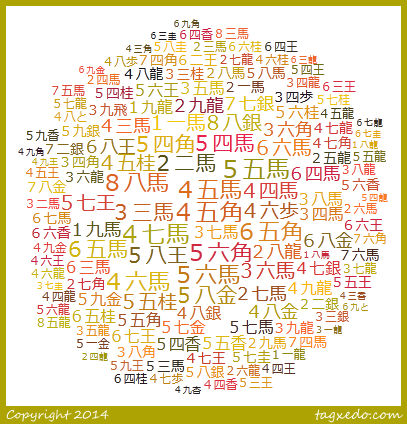
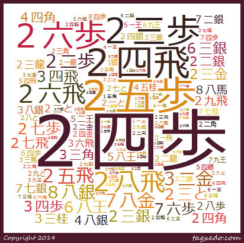
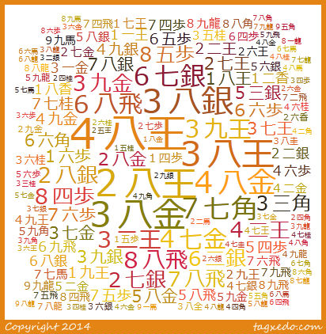
